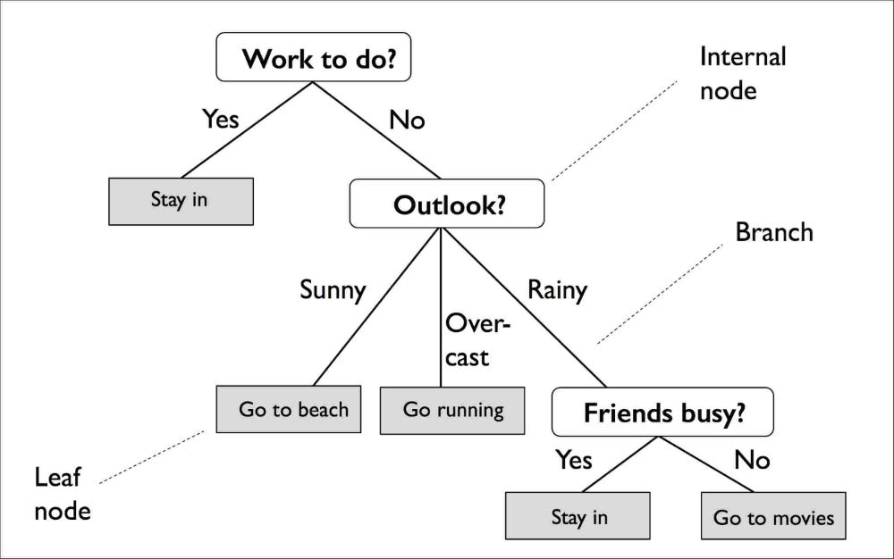
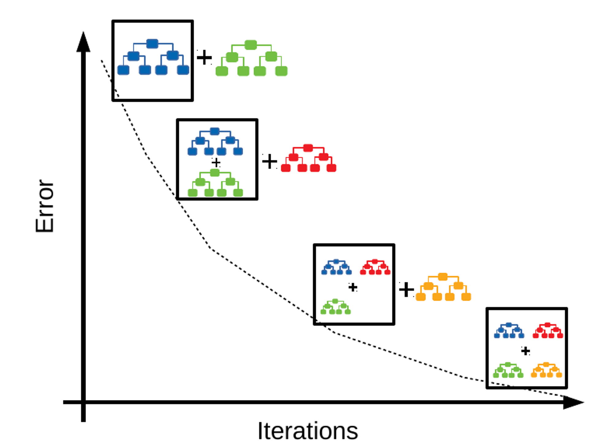

# Machine-learning : prix des logements à Paris

## Avant-propos

Ce document présente l'algortihme de machine learning à utiliser pour le projet d'**agence immobilière en ligne**. Vous pouvez consulter librement ce document, mais peut-être serait-il plus judicieux de commencer par lire le cahier des charges [ici](./cahier-des-charges.md)


## Présentation de l'algorithme de Machine-Learning

Ce projet utilise un algorithme de Machine-Learning de type *Gradient Boost* s'appuyant sur un algo de *Regression tree*. 

Pour faire le plus simple possible, un *Regression tree* est un modèle d'apprentissage supervisé utilisé pour prédire les valeurs d'une variable en fonction d'autres variables explicatives, c'est à dire une suite de conditions les unes après les autres chaque condition produisant un certain résultat ou lançant de nouvelles conditions (comme un arbre). En tant que développeur vous connaissez ce genre de choses sans le savoir puisque c'est très exactement ce que vous faites vous-même lorsque vous enchainé plusieur condition sur les même variables.

 

Le *Gradient Boost*, quant à lui, va créer plusieurs *Regression trees* les uns après les autres, dont un plutôt déjà bien efficace qui va par la suite, être épaulé par d'autres *Regression trees* moins efficaces mais qui viendront renforcé, à chaque fois, un peu plus la prédiction du premier. Chaque nouvel arbre contribue ainsi à gagner à chaque foisun peu plus en précision.

 
## Usage

### Prédiction

Pour lancer une prédiction, utilisez la commande suivante :

```shell
php predict.php
```

Qui produira :

```shell
Notre I.A. a estimé votre bien à 555783.92 euros (attendu 600 000)
```

Ce script utilise le modèle pré-entraîné `dvf_model_84.rbx` qui est un modèle efficace à 84%.

Utilisez le code contenu dans cet exemple comme base pour développer votre projet.

### Entraînement

Si vous désirez tenter d'entraîner votre propre version de l'algorithme de ML, vous devrez d'abord charger la BDD en important le fichier `paris_valeur_fonciere.sql` du dossier `_ressources`.

Pensez à modifier le fichier `lib\database.php` pour configurer votre connection à votre BDD.

Vous pouvez alors utiliser le script d'entraînement :

```shell
php train.php
```

Le script, tel que configuré par défaut, va procéder ainsi :

1. entraîner un nouvel algo en utilisant 5000 données aléatoires issues de la BDD ,
2. enregistrer le modèle obtenu dans un fichier temporaire `tmp_model.rbx`,
3. tester le modèle 10 fois, avec 1000 données à chaque fois afin d'établir un score moyen de précision,
4. rennomer le fichier de sauvegarde pour y intégrer le score afin de proposer une classification des modèles les plus efficaces.

### Se mettre à jour et utiliser la base de données

* Pull la branch dev qui est propre et à jour (Ne pas toucher à cette branche !!!)
* créer dans PHPMyAdmin une base de données ‘recupdb’
* Dans cette BDD, importer le dump de js (dans le dossier ‘_ressources’)
* Faire une migration (doctrine:migration:migrate)
* Utiliser cette commande pour le fixtures:load :

```shell
php -d memory_limit=1024M bin/console doctrine:fixtures:load
```

 


